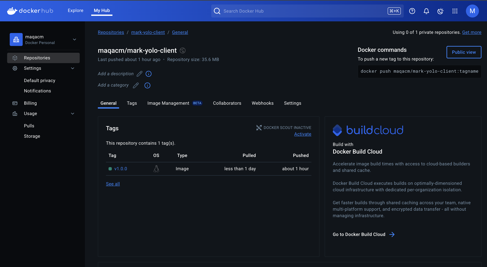
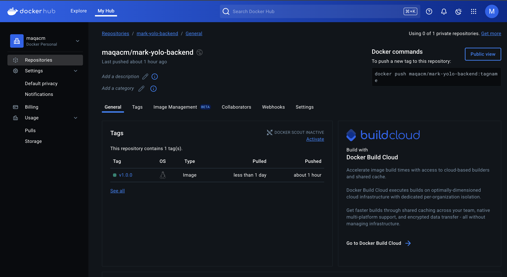

# Week 4 IP 2 Creating a Basic Micro-service

## 1. Choice of Base Images

### Client  Container
- `node:16-alpine`
    - Alpine variant for minimal size 
    - Provides just enough dependencies to build the React application
-  `alpine:3.21.3`
    - Ultra-minimal base image
    - Only added necessary packages (nodejs)
    - Significant reduction in attack surface and image size
    - This resulted to an image of 86.7MB

### Backend Container
-  `node:23-alpine3.20`
    - Chosen for compatibility with backend dependencies
    - Alpine variant for minimal size

-  `alpine:3.21.3`
    - Minimal base image with only necessary runtime dependencies
    - Installed only nodejs 
    - This resulted to an image of 98.6MB

### Database Container
- `mongo:latest`
    - Official MongoDB image with stable performance
    - Using latest tag for current security patches and features

## 2. Dockerfile Directives

**Key Directives**:
- `FROM ... AS build`: Multi-stage build to separate build-time dependencies from runtime
- `WORKDIR`: Sets the working directory for subsequent instructions
- `COPY` with selective paths: Only copying necessary files
- `RUN npm ci`: Using clean install for predictable builds
- `RUN addgroup/adduser`: Creating non-root user for security
- `COPY --from=build --chown`: Copying only built artifacts with proper ownership
- `USER nodejs`: Running as non-root for security
- `EXPOSE`: Documenting the port the application uses
- `CMD`: Defining the command to run when the container starts

## 3. Docker Compose Networking


**Networking Implementation**:
- **Bridge Network**: Created a custom bridge network `app-net` for container isolation and communication
- **Service Discovery**: Containers can communicate using service names (e.g., `mark-yolo-backend` and `app-ip-mongo`)
- **Port Allocation**:
    - Frontend: Exposing port 3000 for web access
    - Backend: Exposing port 4000 externally, mapping to internal port 5000
    - MongoDB: Standard port 27017 available externally for development
- **Network Configuration**:
    - Defined subnet and IP range (172.20.0.0/16)
    - Made network attachable for external connections

## 4. Docker Compose Volume Definition and Usage

```yaml
volumes:
  app-mongo-data:
    driver: local
```

**Volume Implementation**:
- Created named volume `app-mongo-data` for MongoDB data persistence
- Mounted to `/data/db` inside MongoDB container
- Used local driver for storage on host machine
- Ensures data survives container restarts and rebuilds
- Optimizes database performance by separating data storage from container lifecycle

## 5. Git Workflow

The development workflow followed these steps:

1. **Initial Setup**:
    - Created basic Dockerfiles for each service
    - Set up docker-compose.yml for local development

2. **Iterative Development**:
    - Made incremental improvements to container builds
    - Committed changes with descriptive messages
    - Tested containers locally after each significant change

3. **Optimization Phase**:
    - Implemented multi-stage builds
    - Reduced image sizes
    - Enhanced security with non-root users

4. **Integration Testing**:
    - Tested interactions between services
    - Verified network connectivity
    - Validated data persistence

5. **Deployment**:
    - Tagged images with semantic versioning
    - Pushed to Docker Hub repository
    - Documented deployment process

## 6. Application Execution and Debugging

### Successful Running
The application was successfully deployed with:
```bash
docker-compose up -d
```

### Debugging Measures
Several issues were encountered and resolved:

1. **CORS Issues**:
    - Symptom: `Access to XMLHttpRequest at 'http://localhost:5000/api/products' from origin 'http://localhost:3000' has been blocked by CORS policy`
    - Solution: Changed the exposed port on host to 4000,as a process was running on 5000 that could not be forcefully shut down and was causing the CORS issues

2. **React Build Errors**:
    - Symptom: `Error: error:0308010C:digital envelope routines::unsupported`
    - Solution: Downgraded to Node.js 16 for compatibility with React build process

3. **Service Discovery Issues**:
    - Symptom: `GET http://mark-yolo-backend:5000/api/products net::ERR_NAME_NOT_RESOLVED`
    - Solution: Updated frontend to use proper URLs and environment variables

4. **Port Conflicts**:
    - Symptom: `ERR_UNSAFE_PORT` for port 6000
    - Solution: Changed to standard ports (3000, 4000, 27017)

5. **MongoDB Connection Issues**:
    - Symptom: Backend failing to connect to database
    - Solution: Updated connection string to use container name instead of localhost

## 7. Docker Image Naming Standards

A consistent tagging strategy was implemented:

- Format: `username/service-name:semantic-version`
- Examples:
    - `maqacm/mark-yolo-client:v1.0.0`
    - `maqacm/mark-yolo-backend:v1.0.0`

## 8. DockerHub Deployment
**Client image**:

**Backend image**:

